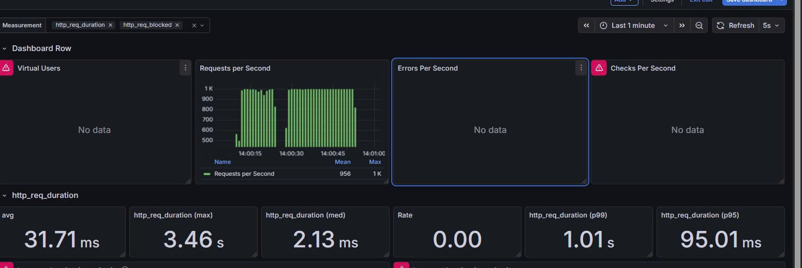
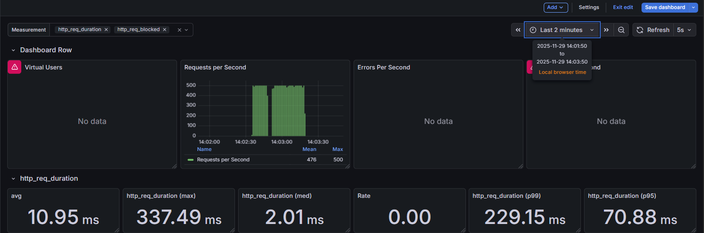

# 📄 Architecture Decision Record (ADR) 002: Offload Tải Ghi bằng Caching & Data Store Phi-quan hệ

**Thuộc tính**

| Thuộc tính             | Mô tả |
|------------------------|-------|
| **Tiêu đề**            | Sử dụng Redis GEO để xử lý Dữ liệu Vị trí Tài xế Thời gian thực |
| **Trạng thái**         | Đã Chấp nhận (Accepted) |
| **Ngày**               | [Ngày hiện tại] |
| **Người ra quyết định**| [Tên của bạn - Kỹ sư Kiến trúc Hệ thống] |

---

## 1. Bối cảnh (Context)

Tính năng **Cập nhật vị trí tài xế (Location Update)** là luồng **Write-Intensive** (ghi dữ liệu cường độ cao) và **Read-Intensive** (đọc dữ liệu cường độ cao – tìm kiếm tài xế gần đó), diễn ra liên tục:

- **Vấn đề Chi phí & Hiệu năng DB:**  
  Hệ thống Legacy ghi trực tiếp vào **Cơ sở dữ liệu Quan hệ (RDBMS)**. CPU của DB tăng lên **95–100%** dưới tải nhẹ (2,000 VUs), dẫn đến **chi phí Cloud cao** và vượt ngân sách (~$40,000/tháng).

- **Vấn đề Latency Ghi:**  
  Avg Response Time để ghi dữ liệu là **150 ms**, quá chậm cho dữ liệu thời gian thực, làm giảm trải nghiệm tài xế.

---

## 2. Quyết định (Decision)

- **Redis (GEO-spatial)** được sử dụng để lưu trữ và truy vấn dữ liệu vị trí tài xế thời gian thực.  
- Redis làm **Primary Data Store** cho dữ liệu vị trí (Ephemeral – có thể tái tạo).  
- Sử dụng **GEO-spatial API** (`GEOADD`, `GEOSEARCH`) để tối ưu truy vấn "Tìm Tài xế gần User nhất" từ độ phức tạp cao trên RDBMS xuống hiệu năng cao của Redis.  
- **CSDL Quan hệ (PostgreSQL/MySQL):** được giải phóng khỏi tải ghi cường độ cao, tập trung vào **dữ liệu giao dịch (Transactional data)**.

---

## 3. Cân nhắc (Options Considered)

| Phương án               | Ưu điểm | Nhược điểm |
|-------------------------|---------|------------|
| **A. Tăng cấu hình RDBMS** | Giải pháp nhanh, không cần thay đổi code nhiều | Chi phí rất cao, không giải quyết bản chất Write-Intensive, chỉ là giải pháp tạm thời |
| **B. DynamoDB**           | Khả năng Scale vô hạn, chi phí tối ưu cho tải ghi | Không có chức năng GEO-spatial hiệu quả như Redis, thao tác tìm kiếm vị trí phức tạp hơn |
| **C. Redis (Đã chọn)**    | Tốc độ cực cao (In-memory), chi phí vận hành thấp hơn DB Quan hệ, sẵn có GEO-spatial API tối ưu | Dữ liệu là Ephemeral (có thể mất khi sập nếu không dùng Persistence), cần quản lý thêm dịch vụ (ElastiCache/Redis) |

---

## 4. Hệ quả (Consequences / Trade-offs)

| Loại       | Chi tiết |
|------------|---------|
| **Tích cực (Benefits)** | **Chi phí (FinOps):** CPU Database giảm từ 95–100% xuống <5%, giảm kích thước DB, tiết kiệm Cloud đáng kể   **Hiệu năng Ghi:** Avg Response Time giảm từ nhiều (cải thiện rất nhiều lần lần)   **Hiệu năng Đọc (Tìm kiếm):** Truy vấn tìm tài xế gần User tối ưu từ O(n) xuống O(log n) nhờ Redis GEO |
| **Tiêu cực (Drawbacks)** | **Vận hành (Operations):** Cần quản lý vòng đời dữ liệu Redis và đảm bảo Persistence nếu cần   **Phân mảnh Dữ liệu:** Tạo ra hai nguồn dữ liệu (CSDL Quan hệ cho Transaction, Redis cho vị trí) |

## 5. Load Testing
### Yêu cầu: P99 Latency < 100ms + RPS = 1000
### 📊 Sử dụng Blocking I/O + Geo Redis
 
 - Vì dùng Blocking I/O và 1 instance xử lý cập nhật mà load testing local (vUser = 1000) với resource (8 core và 16GB, với driver service vCPU: 0.5 và Memory: 768M) nên chuyển việc nhận message vị trí sang Non Blocking + Scale intance theo chiều ngang
 ### 📊 Scale theo chiều ngang
 
Nguyên nhân: P99 Latency không thể đáp ứng yêu cầu vì GC Pause (Dọn rác) và Context Switching(Việc chuyển đổi giữa 100 luồng trên giới hạn 0.5 vCPU cũng gây ra overhead)
