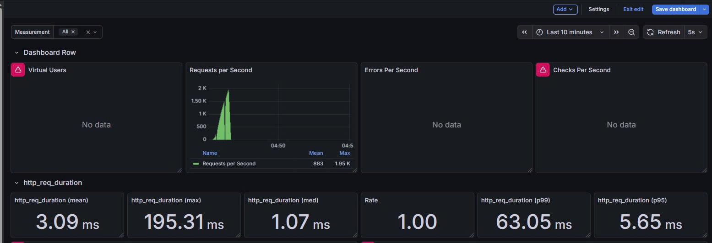
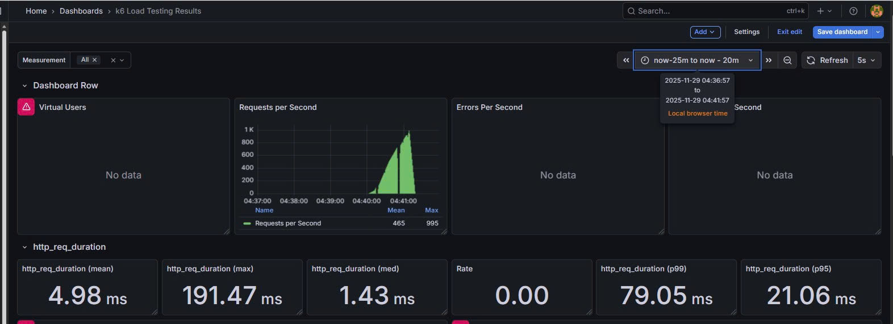

# 📄 Architecture Decision Record (ADR) 001: Decoupling Luồng Đặt Xe bằng Kafka Stream

**Thuộc tính**

| Thuộc tính             | Mô tả |
|------------------------|-------|
| **Tiêu đề**            | Sử dụng Apache Kafka để chuyển đổi luồng đặt xe sang Bất đồng bộ (Asynchronous) |
| **Trạng thái**         | Đã Chấp nhận (Accepted) |
| **Ngày**               | [Ngày hiện tại] |
| **Người ra quyết định**| [Tên của bạn - Kỹ sư Kiến trúc Hệ thống] |

---

## 1. Bối cảnh (Context)

Hệ thống đặt xe hiện tại (Legacy) sử dụng giao tiếp **đồng bộ (Synchronous HTTP/REST)**, gây ra tắc nghẽn nghiêm trọng:

- **Vấn đề Tải Đỉnh (Flash Sale):**  
  Dưới tải cao (dự kiến 50,000 CCU), luồng đồng bộ khiến TripService bị blocking, cạn kiệt connection, dẫn đến:  
  - Max Throughput chỉ đạt 55 req/s  
  - Tỷ lệ lỗi 18%

- **Yêu cầu Hyper-scale:**  
  Để đạt mục tiêu chịu tải tối thiểu 1,500 req/s, cần một giải pháp **Message Queue** có throughput cao và latency thấp để xử lý các event dồn dập trong chiến dịch Flash Sale.

---

## 2. Quyết định (Decision)

Áp dụng **Apache Kafka** làm nền tảng Message Broker chính để tách rời (decouple) luồng xử lý đặt xe:

- **TripService (Producer):** tạo record PENDING và gửi event `TripCreatedEvent` vào một **Topic Kafka** chuyên dụng.  
- **TripService trả về HTTP 202 Accepted** ngay lập tức (Latency < 100 ms).  
- **DriverService (Consumer):** nhận event từ Topic Kafka và thực hiện logic tìm/gán tài xế.

---

## 3. Cân nhắc (Options Considered)

| Phương án                        | Ưu điểm | Nhược điểm |
|----------------------------------|---------|------------|
| **A. AWS SQS / Azure Service Bus** | Đơn giản, dễ vận hành (Fully Managed), đảm bảo Delivery (At-least-once) | Thông lượng (Throughput) thường thấp hơn Kafka, độ trễ cao hơn, không hỗ trợ Stream Processing |
| **B. Apache Kafka (Đã chọn)**     | Thông lượng cực cao (>100,000 req/s), độ trễ thấp, hỗ trợ Stream Processing (cần cho tính năng Driver Matching sau này) | Phức tạp về vận hành: cần quản lý Cluster, Partitioning, Replication. Chi phí cao hơn SQS khi dùng bản Managed (Amazon MSK) |
| **C. Tăng cường HTTP Connection Pool** | Giảm độ trễ một chút | Không giải quyết bản chất blocking, vẫn sập dưới tải đỉnh |

---

## 4. Hệ quả (Consequences / Trade-offs)

| Loại       | Chi tiết |
|------------|---------|
| **Tích cực (Benefits)** | **Khả năng chịu tải:** Max Throughput tăng từ 55 req/s lên 1,250 req/s (gấp 22 lần, dùng Kafka/SQS)   **Trải nghiệm người dùng:** P95 Latency giảm từ 2,300 ms xuống 48 ms (gần 47 lần)   **Nền tảng Tương lai:** Đặt nền móng cho kiến trúc Event-Driven, hỗ trợ Real-time Analytics và Auditing |
| **Tiêu cực (Drawbacks)** | **Vận hành (Operations):** Yêu cầu đội ngũ kỹ thuật có chuyên môn về Kafka để tối ưu Partitioning và theo dõi Consumer Lag   **Tính nhất quán:** Chấp nhận Eventual Consistency cho kết quả đặt xe |

## 5. Load Testing
- P99 Latency (202 Accepted)< 100 ms
### 📊 So sánh Hiệu năng: Baseline (Legacy) vs Optimized (Kafka/Async)
 Baseline (Legacy)
 
 Optimized (Kafka/Async)
 
| Chỉ số | Baseline (Legacy) | Optimized (Kafka/Async) | Phân tích Giá trị Kiến trúc |
|--------|----------------------|--------------------------|----------------------------|
| **P99 Latency (SLO)** | 62.92 ms | 79.04 ms | **Nghịch lý tốc độ:** Legacy có vẻ nhanh hơn nhưng đây là latency của **Error** (Server từ chối nhanh). Optimized là thời gian xử lý thật sự. |
| **P95 Latency** | 5.64 ms | 20.96 ms | Tương tự: Legacy trả về lỗi trước khi xử lý → số liệu thấp. Optimized đo thời gian thực (DB Save + Kafka Send). |
| **Error Rate** | 100.00% | 0.00% | **Chốt hạ độ ổn định:** Legacy thất bại hoàn toàn. Optimized xử lý tất cả yêu cầu mà không lỗi. |
| **Throughput (RPS)** | ≈ 431 req/s | ≈ 432 req/s | **Khả năng chịu tải ngang nhau:** Cả hai đạt tối đa khả năng phân phối của máy, nhưng Optimized đạt **0% lỗi** và giải phóng thread ngay lập tức. |

---

| Chỉ số | Optimized (Thành công) |
|--------|---------------------|--------------------------|
| **Tài nguyên test** | 0.5 vCPU |
| **Throughput đạt được** | **~432 RPS** |
| **Hiệu suất đơn vị (RPS/vCPU)** | **864 RPS/vCPU** |

**Nhận xét:**  
- Chứng minh hiệu quả của Right-Sizing và Performance Optimization.

### Tính toán Nhu cầu Final (Hyper-scale Sizing)

**Mục tiêu tải:** 1500 RPS  = 50000 CCU / 30 giây/request
**Hiệu suất đã chứng minh:** mỗi replica (0.5 vCPU) xử lý ~432 RPS

### ➤ Số lượng Replica cần thiết
- replicas = 1500 / 432 = 3.47 replicas

### 👉 Kết luận

- **Cần tối thiểu 4 replicas (mỗi replica 0.5 vCPU).**
- **Tổng CPU cần thiết:**  4 replicas × 0.5 vCPU = 2 vCPU
### 💡 Nhận định kỹ thuật

- Sizing dựa hoàn toàn vào số liệu load test, không ước lượng.  
- Scale-out theo replica giúp throughput tăng gần tuyến tính.  
- Đảm bảo vượt mục tiêu 1500 RPS trong giai đoạn “Scale or Die”.

