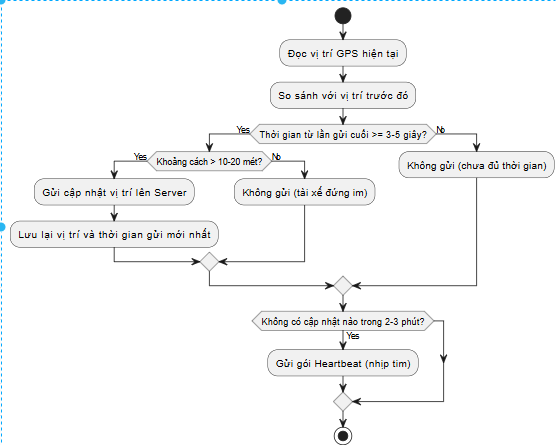

# Module A: Thiết kế Kiến trúc cho Scalability & Performance

## 1. Use Case 1: Đặt xe (Booking)

### 1. Phân tích và Bảo vệ Lựa chọn Kiến trúc

**Vấn đề (Problem):**  
- Nếu dùng HTTP đồng bộ (synchronous), luồng TripService → DriverService sẽ bị **blocking**.  
- TripService phải chờ DriverService tìm tài xế, và DriverService phải chờ tài xế xác nhận (vài giây đến hàng chục giây).  
- Khi tải tăng đột biến, TripService sẽ cạn kiệt connection, gây tắc nghẽn toàn hệ thống và sập.

**Giải pháp 1: Tách rời (Decouple) bằng Giao tiếp Bất đồng bộ (Asynchronous)**  
- **Lựa chọn:** Sử dụng Message Queue (SQS, Kafka, RabbitMQ) giữa TripService và DriverService.  
- **Luồng xử lý:**  
  1. User gọi API đặt xe → TripService.  
  2. TripService tạo record với trạng thái `PENDING` và đẩy event `CreateTripEvent` vào Message Queue.  
  3. TripService trả về HTTP 202 Accepted (hoặc 200 OK) cho User ngay lập tức (< 100ms) với thông báo "Đang tìm tài xế...".  
- **Trade-off:**  
  - Đánh đổi tính nhất quán tức thời (immediate consistency) để lấy **availability** và **scalability**.  
  - User sẽ nhận thông báo sau khi tài xế xác nhận (eventual consistency).  

**Giải pháp 2: Giao tiếp Real-time với WebSocket**  
- **Lựa chọn:** Sử dụng WebSocket full-duplex cho Driver và Customer.  
- **Bảo vệ quyết định:**  
  - **Driver:** DriverService nhận event từ Message Queue → đẩy cuốc mới đến tài xế qua WebSocket → tối ưu thời gian tìm kiếm nhanh nhất.  
  - **Customer:** Khi tài xế xác nhận → TripService đẩy trạng thái `ASSIGNED` qua WebSocket cho Customer.

---

### 2. Kiểm chứng Thiết kế bằng Load Testing

- **Kịch bản:**  
  - Sử dụng k6/JMeter mô phỏng 1.000–5.000 user đồng thời gọi API POST `/trips` trong 1 phút.  
- **Metrics cần theo dõi:**  
  1. **TripService API:** P99 Latency < 200ms, Error Rate = 0%.  
  2. **Message Queue Depth:** Khi tải tăng, queue depth có thể tăng vọt nhưng phải giảm dần. Nếu queue không giảm, DriverService xử lý không kịp → cần tuning.

---

### 3. Hiện thực hóa Kỹ thuật Tối ưu hóa (Tuning)

- **Vấn đề:** DriverService xử lý message không kịp → tồn đọng.  
- **Giải pháp (Tuning): Auto Scaling Group cho DriverService**  
  - Logic:  
    - Nếu số lượng message trong queue > 1000 → thêm instance DriverService.  
    - Nếu số message < 100 → giảm instance để tiết kiệm chi phí.  

---
# ĐẶT XE

---
## 2. Use Case 2: Cập nhật vị trí của Driver

### 1. Phân tích và Bảo vệ Lựa chọn Kiến trúc

**Vấn đề 1: Storage & Search**  
- Cần truy vấn hàng nghìn–hàng chục nghìn tài xế theo bán kính 5km, tốc độ realtime.  
- **Giải pháp:** Redis GEO  
- **Lý do chọn Redis GEO:**  
  1. **Tốc độ:** Lưu trên RAM, lệnh GEOADD/GEORADIUS sub-millisecond.  
  2. **Hiệu quả:** Cập nhật vị trí dễ dàng, API sẵn có.  
  3. **Đơn giản & ổn định:** Không cần triển khai cấu trúc dữ liệu phức tạp, dễ tích hợp microservices.  
  4. **Khả năng mở rộng:** Hỗ trợ cluster, scale horizontal.  

**Vấn đề 2: Giao thức cập nhật vị trí**  
- **Giải pháp:** gRPC (Client-side Streaming)  
- **Lý do:**  
  1. **Size tối ưu:** Protobuf nhị phân, vài bytes cho mỗi vị trí.  
  2. **Efficiency:** Stream liên tục trên HTTP/2, tiết kiệm pin và băng thông so với REST.  

---

### 2. Kiểm chứng Thiết kế bằng Load Testing

- **Write Test:** 50.000 tài xế (VUs) mở gRPC stream, gửi vị trí mới mỗi 5s (~10.000 RPS).  
- **Read Test:** 1.000 request đặt xe/s, mỗi request query GEORADIUS (5km) trên Redis.  
- **Metrics:**  
  - Redis CPU Utilization (<100%).  
  - P99 Latency GEORADIUS < 10ms.

---

### 3. Hiện thực hóa Kỹ thuật Tối ưu hóa (Tuning)

1. **Auto Scaling Group cho DriverService:** scale dựa trên CPU hoặc Network Traffic.  
2. **Read Replicas (Bản sao chỉ đọc):**  
   - Primary Node xử lý GEOADD (ghi).  
   - Replica Nodes xử lý GEORADIUS (đọc).  
   - Tách biệt hoàn toàn tải "ghi" và "đọc".  
3. **Sharding (Phân mảnh) Redis Cluster:**  
   - Nếu Primary Node quá tải (CPU 100%), phân mảnh theo Geohash → scale ngang vô hạn.

---

# ⚙️ Nguyên tắc Gửi Dữ liệu vị trí của Driver

Ứng dụng **chỉ gửi vị trí mới** lên `DriverService` khi **một trong hai điều kiện sau** được thỏa mãn:

1. **Đã trôi qua hơn 3–5 giây** kể từ lần gửi cuối
    Hình này là nguyên tắc chu kỳ thời gian gửi
   
3. **Hoặc** tài xế đã di chuyển **hơn 10–20 mét** so với vị trí trước đó  

> 👉 Nhờ vậy, khi tài xế đứng yên (kẹt xe, dừng đèn đỏ...), ứng dụng **không gửi liên tục** dữ liệu trùng lặp.

---

### 💓 Cơ chế “Heartbeat” Dự phòng

Nếu tài xế **đứng im quá lâu** (trên 2–3 phút), ứng dụng sẽ gửi một **gói “heartbeat”** để báo cho server biết:  
> “Tôi vẫn đang online, chỉ là chưa di chuyển.”

---

### 🚀 Lợi ích

| Lợi ích | Mô tả |
|----------|--------|
| 🔋 Tiết kiệm pin | Không gửi request liên tục khi không cần thiết |
| 🌐 Giảm tải server | Giảm số lượng API call và update vào Redis/MongoDB |
| ⚡ Phản hồi nhanh | Gửi ngay khi tài xế di chuyển đủ xa |
| 🧠 Dễ mở rộng | Có thể tinh chỉnh ngưỡng `distance_threshold` và `time_interval` động theo trạng thái |

---

## ⚡ Tại sao chọn WebSocket cho TripService

WebSocket được chọn để hỗ trợ giao tiếp **hai chiều (bi-directional)** giữa server và client theo **thời gian thực**.

### 🚖 1. Đặc thù của TripService
TripService là trung tâm điều phối giữa:
- 🧍‍♂️ **Người dùng (User)**: tạo và theo dõi chuyến đi  
- 🚗 **Tài xế (Driver)**: nhận cuốc, cập nhật trạng thái và vị trí  

Hệ thống cần cập nhật **liên tục**:
- Khi tài xế **nhận cuốc**, người dùng thấy ngay  
- Khi người dùng **hủy**, tài xế biết ngay  
- Khi tài xế **di chuyển**, vị trí được cập nhật real-time  

---

# 3. 🛡️ UserService (Auth) → PostgreSQL

## 1. Phân tích và Bảo vệ Lựa chọn Kiến trúc

### Phân tích (Nhiệm vụ)
- UserService quản lý **dữ liệu nhạy cảm** và có cấu trúc chặt chẽ (users, profiles, credentials).
- Yêu cầu quan trọng nhất:
  - **Tính nhất quán (Consistency)**
  - **Toàn vẹn dữ liệu (Integrity)**

### Bảo vệ Quyết định (Chọn PostgreSQL)
- Chúng em chọn **CSDL Quan hệ (PostgreSQL)** vì đảm bảo **ACID** (Atomicity, Consistency, Isolation, Durability).
- Khi người dùng đổi mật khẩu, hệ thống phải thực thi **ngay lập tức và chính xác 100%**, không chấp nhận **Eventual Consistency**.
- Dữ liệu người dùng (users và user_profiles) có quan hệ 1-1 rõ ràng:
  - PostgreSQL hỗ trợ **constraints** và **foreign keys** đảm bảo dữ liệu không bị sai lệch.

### Trade-off (Đánh đổi)
- Hy sinh:
  - **Schema flexibility** (tính linh hoạt của cấu trúc)
  - **Khả năng scale-out (ghi) phức tạp hơn**
- Lợi ích:
  - Đổi lấy **tính nhất quán tuyệt đối** và **toàn vẹn dữ liệu**.

## 2. Kiểm chứng Thiết kế bằng Load Testing

### Kịch bản 1 (Read-heavy)
- Mô phỏng **5.000 người dùng đăng nhập (login) đồng thời**.
- Metric: **P99 Latency** của API login.
- Bottleneck: **CPU của CSDL chính**.

### Kịch bản 2 (Write-heavy)
- Mô phỏng **1.000 người dùng đăng ký (register) đồng thời**.
- Metric: **Error Rate** và số lượng **kết nối (connections)** đến CSDL.

## 3. Hiện thực hóa các Kỹ thuật Tối ưu hóa (Tuning)

### Vấn đề
- Load Test cho thấy **CPU của Primary Node bị quá tải** khi có nhiều yêu cầu đọc đồng thời.

### Giải pháp (Tuning)
- **Mở rộng CSDL bằng Read Replicas**
  - Hiện thực:
    - 1 **Primary Node** (ghi)
    - 2 **Read Replica Nodes** (đọc)
  - Logic:
    - **Ghi** (Đăng ký, Đổi mật khẩu) → Primary Node
    - **Đọc** (Đăng nhập, Lấy hồ sơ) → Read Replicas
  - Kết quả:
    - Giảm tải CPU cho Primary Node
    - Tăng throughput cho luồng **read**
    - Đáp ứng yêu cầu của Module A

---
# 4. 🧾 TripService → MongoDB

## 1. Phân tích và Bảo vệ Lựa chọn Kiến trúc

### Phân tích (Nhiệm vụ)
TripService quản lý **vòng đời của một cuốc xe**. Một cuốc xe là một **document** có cấu trúc liên tục thay đổi:

- **Bắt đầu:** `{ user_id, pickup, destination, status: "PENDING" }`
- **Thêm tài xế:** `{ ... , driver_id: "xyz", status: "ASSIGNED" }`
- **Thêm lịch sử tuyến đường:** `{ ... , route_history: [...], status: "ON-TRIP" }`
- **Hoàn thành và đánh giá:** `{ ... , final_fare: 10, rating: 5, status: "COMPLETED" }`

### Bảo vệ Quyết định (Chọn MongoDB)
- Chọn **MongoDB (DocumentDB)** vì **Flexible Schema**:
  - Dễ dàng thêm các trường mới (`rating`, `payment_method`,...) mà không cần ALTER TABLE.
  - Hỗ trợ phát triển nhanh, linh hoạt.
- **Tối ưu cho đọc (Read Optimization):**
  - Toàn bộ thông tin cuốc xe được lưu trong một **document duy nhất**.
  - Khi cần xem chi tiết cuốc xe, chỉ cần **1 thao tác đọc**, không cần JOIN nhiều bảng như SQL.
- **Khả năng mở rộng (Scalability):**
  - MongoDB hỗ trợ **sharding**, dễ dàng scale-out khi số lượng cuốc xe lên hàng triệu, hàng tỷ.

### Trade-off (Đánh đổi)
- Chấp nhận **tính nhất quán yếu hơn** (`eventual consistency`) giữa nhiều document.
- Đổi lấy **sự linh hoạt của schema** và **khả năng scale-out** dễ dàng.

---

## 2. Kiểm chứng Thiết kế bằng Load Testing

### Kịch bản (Write-heavy)
- Mô phỏng **1.000 người dùng đặt xe đồng thời** ("Thundering Herd").
- Tạo ra **1.000 lượt "ghi" (create document)** mới.

### Metrics cần theo dõi
- **P99 Latency** của API đặt xe
- **Tỷ lệ lỗi ghi**

### Bottleneck
- Disk I/O hoặc CPU của MongoDB khi tải cao.

---

## 3. Hiện thực hóa các Kỹ thuật Tối ưu hóa (Tuning)

### Vấn đề
- Load Test cho thấy **độ trễ "ghi" tăng vọt** khi tải cao.

### Giải pháp (Tuning)
- **Sharding (Phân mảnh)**
  - Khi một instance MongoDB không thể chịu nổi tải "ghi", shard collection `trips`.
  - **Shard key:** `trip_id` hoặc `user_id`
  - Logic: Tải "ghi" được phân tán ra nhiều **shard**, cho phép **scale ngang gần như vô hạn**.
- **Tuning phụ: Tối ưu Indexes**
  - Đảm bảo tất cả các trường dùng để truy vấn (`status`, `driver_id`) đều được **index**, tăng tốc tìm kiếm và lọc document.
---
# 5. Lựa chọn Giao thức Giao tiếp: REST API (Giai đoạn "Bộ Xương")

## 1. Phân tích và Bảo vệ Lựa chọn Kiến trúc

### Phân tích (Nhiệm vụ)
Cần một cơ chế **giao tiếp service-to-service** cho 3 services "bộ xương" (UserService, TripService, DriverService) để chúng có thể gọi API lẫn nhau.

### Lựa chọn đã cân nhắc
- **gRPC:** Hiệu năng cao, băng thông thấp (dùng Protobuf), phù hợp "hyper-scale".
- **REST API:** Phổ biến, đơn giản, dễ debug (dùng JSON).

### Bảo vệ Quyết định (Chọn REST API)
Chúng em chọn **REST API** cho giai đoạn "bộ xương" ban đầu vì:

1. **Tốc độ phát triển (Development Speed) và Tính đơn giản (Simplicity)**:
   - REST sử dụng JSON, **human-readable**, dễ debug với Postman hoặc curl.
2. **REST phù hợp triển khai bước đầu**:
   - API chưa ổn định, gRPC cần `.proto` và code generation sẽ làm chậm tiến độ.

### Trade-off (Đánh đổi)
- REST có **độ trễ (latency) cao hơn** và **tốn băng thông** hơn gRPC.
- Chấp nhận **"nợ kỹ thuật" (technical debt)** về hiệu năng ở Giai đoạn 1 để hoàn thành "bộ xương" nhanh.
- Vấn đề hiệu năng sẽ được giải quyết ở Giai đoạn 2 bằng **migrate hot paths sang gRPC**.

---

## 2. Kiểm chứng Thiết kế bằng Load Testing

### Mục tiêu
Đo lường **cái giá** của việc dùng REST trong giao tiếp service-to-service.

### Kịch bản (k6)
- Mô phỏng **TripService gọi UserService** **1.000 lần/giây**.

### Metrics cần theo dõi
1. **P99 Latency:** Độ trễ của cuộc gọi nội bộ (chắc chắn cao hơn gRPC, ví dụ 50ms so với 5ms).
2. **Network Throughput:** Lượng dữ liệu (bytes) truyền tải (JSON tốn băng thông hơn Protobuf).
3. **RPS (Requests Per Second):** Giới hạn RPS trước khi latency tăng vọt.

---

## 3. Hiện thực hóa các Kỹ thuật Tối ưu hóa (Tuning)

### Vấn đề
- Load Test chứng minh **REST API là điểm nghẽn** khi hệ thống scale cao:
  - Độ trễ tăng
  - Chi phí mạng cao

### Giải pháp (Tuning)
- **Di chuyển các hot paths từ REST sang gRPC** một cách có chủ đích.

### Hiện thực
- Không di chuyển toàn bộ, chỉ **tập trung các luồng quan trọng**:
  - **Luồng Cập nhật vị trí** (write-heavy, cần Protobuf để giảm size)
  - **Luồng Tìm kiếm tài xế** (read-heavy, cần gRPC để giảm latency)

### Kết quả
- Giảm đáng kể **độ trễ** và **chi phí mạng**.
- Cho phép hệ thống đáp ứng yêu cầu **hyper-scale** của Module A.
- REST ban đầu cho phép chúng em **dựa trên dữ liệu Load Test để quyết định tối ưu**, thay vì tối ưu sớm không cần thiết.

