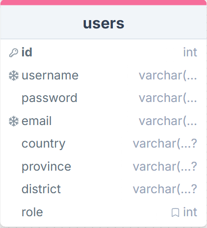
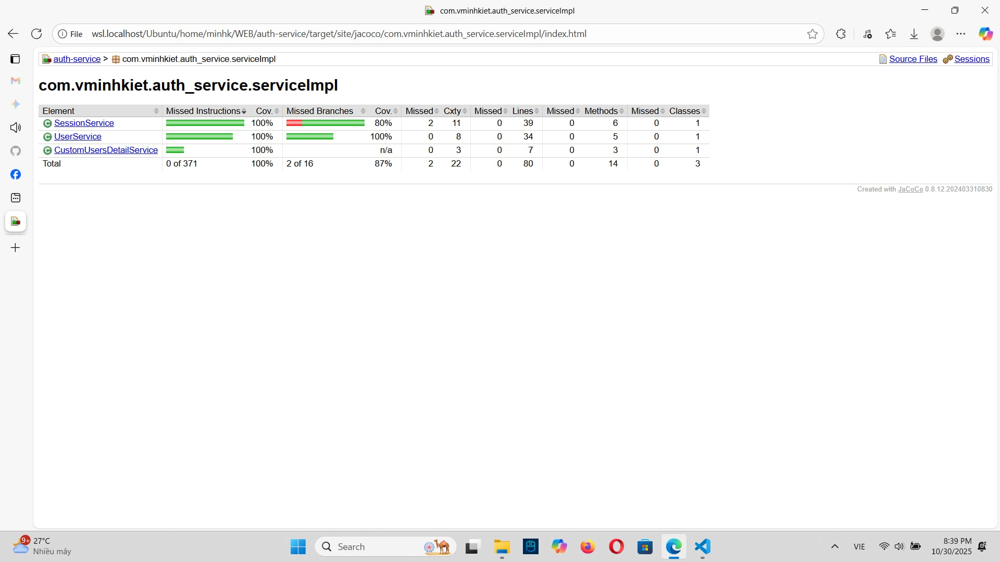

# 🏗️ UIT-Go System Architecture

Tài liệu này trình bày **kiến trúc hệ thống tổng quan** và **kiến trúc chi tiết cho các module** của dự án **UIT-Go** — hệ thống đặt xe thời gian thực theo mô hình Microservice. Use case triển khai có trong folder Image.
## Mục lục

1. [Kiến trúc Tổng quan (Giai đoạn 1: Bộ Xương)](#kiến-trúc-tổng-quan-giai-doan-1-bộ-xương)
    - [Sơ đồ Kiến trúc](#sơ-đồ-kiến-trúc)
    - [Mô tả Thành phần](#mô-tả-thành-phan)
2. [API Gateway](#api-gateway)
    - [Chức năng chính](#chuc-nang-chinh)
    - [Vai trò trong kiến trúc](#vai-tro-trong-kien-truc)
    - [Triển khai](#trien-khai)
3. [Discovery Service](#discovery-service)
    - [Chức năng chính](#chuc-nang-chinh-1)
    - [Vai trò trong kiến trúc](#vai-tro-trong-kien-truc-1)
    - [Triển khai](#trien-khai-1)
4. [Auth Service](#auth-service)
    - [Chức năng chính](#chuc-nang-chinh-2)
    - [Kiến trúc & Cơ sở dữ liệu](#kien-truc--co-so-du-lieu)
5. [Driver Service](#driver-service)
    - [Mô tả](#mo-ta)
    - [Chức năng chính](#chuc-nang-chinh-3)
    - [Kiến trúc & Thành phần](#kien-truc--thanh-phan)
6. [Trip Service](#trip-service)
    - [Mô tả](#mo-ta-1)
    - [Chức năng chính](#chuc-nang-chinh-4)
    - [Kiến trúc & Thành phần](#kien-truc--thanh-phan-1)
7. [Infrastructure Architecture (AWS)](#infrastructure-architecture-aws)
    - [Terraform Infrastructure as Code](#terraform-infrastructure-as-code)
    - [Deployment Automation](#deployment-automation)
8. [Data Architecture](#data-architecture)
    - [PostgreSQL (Auth Service)](#postgresql-auth-service)
    - [MongoDB (Driver & Trip Services)](#mongodb-driver--trip-services)
    - [Redis (Caching Layer)](#redis-caching-layer)
9. [Message Queue Architecture](#message-queue-architecture)
    - [Apache Kafka](#apache-kafka)
    - [Event Flow](#event-flow)
10. [Containerization & Orchestration](#containerization--orchestration)
    - [Docker Configuration](#docker-configuration)
    - [Docker Compose](#docker-compose)
    - [Container Registry (ECR)](#container-registry-ecr)
11. [Nguyên tắc Thiết kế](#nguyên-tắc-thiết-kế)
    - [Giao tiếp giữa các Service](#giao-tiep-giua-cac-service)
    - [Database per Service](#database-per-service)
    - [Containerization](#containerization)
    - [Infrastructure as Code (IaC)](#infrastructure-as-code-iac)
    - [Triển khai](#trien-khai-2)
12. [Event Flow (Tóm tắt)](#event-flow-tom-tat)
13. [Công nghệ Sử dụng](#cong-nghe-su-dung)
14. [Testing Strategy](#testing-strategy)
15. [Tác giả & Phiên bản](#tac-gia--phien-ban)


---

## 🚀 1. Kiến trúc Tổng quan (Giai đoạn 1: “Bộ Xương”)

Giai đoạn này tập trung xây dựng nền tảng **core system** gồm 3 microservices cơ bản và các thành phần hạ tầng tối thiểu.

---

## 📊 1.1 Sơ đồ Kiến trúc


Sơ đồ thể hiện:
- API GATEWAY, Discovery Service
- AuthService
- TripService
- DriverService
- Kafka (hoặc SQS, RabbitMQ) cho giao tiếp sự kiện
- Redis / PostgreSQL / MongoDB làm backend cho từng service
- Các giao tiếp sử dụng: RestAPI, HTTP/HTTPS, WEBSOCKET

## 🧩 1.2 Mô tả Thành phần

# 🧭 API Gateway

**API Gateway** là **điểm vào duy nhất (entry point)** của toàn bộ hệ thống microservices.  
Tất cả request từ client (mobile app, web app) đều **đi qua Gateway** trước khi đến các service nội bộ như `auth-service`, `trip-service`, `driver-service`, ...

---

### ⚙️ Chức năng chính
- 🔀 **Routing:** Định tuyến request đến đúng microservice tương ứng.  
- 🔒 **Authentication & Authorization:** Kiểm tra token và phân quyền truy cập.  
- 🛡️ **Security Layer:** Che giấu cấu trúc hệ thống nội bộ, tăng cường bảo mật.

---

### 🎯 Vai trò trong kiến trúc
- Đơn giản hóa giao tiếp giữa client và hệ thống backend.  
- Tăng **tính bảo mật**, **dễ quản lý**, và **dễ mở rộng** khi thêm service mới.  
- Hỗ trợ **load balancing**, **caching** và **fallback** khi có service gặp sự cố.

---

### 🚀 Triển khai
| Môi trường | Công nghệ sử dụng |
|-------------|------------------|
| 🏭 **Production** | AWS Application Load Balancer (ALB) hoặc AWS API Gateway |
| 💻 **Development** | Nginx Gateway hoặc Spring Cloud Gateway |

---
# 🔎 Discovery Service

**Discovery Service** chịu trách nhiệm **quản lý và định vị động (dynamic discovery)** các microservices trong hệ thống.  
Thay vì phải cấu hình thủ công địa chỉ IP hoặc hostname, các service sẽ **đăng ký (register)** và **tra cứu (discover)** lẫn nhau thông qua Discovery Service.

---

### ⚙️ Chức năng chính
- 🧭 **Service Registration:** Khi một microservice khởi động, nó tự động đăng ký thông tin (tên service, địa chỉ, cổng) vào Discovery Service.  
- 📡 **Service Lookup:** Các service khác có thể truy vấn để lấy thông tin endpoint hiện tại của service mục tiêu.  
- 🔁 **Dynamic Scaling:** Khi service scale-out (thêm instance mới), Discovery Service tự động cập nhật danh sách node.

---

### 🎯 Vai trò trong kiến trúc
- Loại bỏ sự phụ thuộc vào **cấu hình tĩnh (hardcoded endpoint)**.  
- Giúp hệ thống **linh hoạt, tự phục hồi**, và dễ dàng **mở rộng ngang (horizontal scaling)**.  
- Cung cấp nền tảng cho các cơ chế **load balancing thông minh** tại API Gateway hoặc giữa các service với nhau.

---

### 🚀 Triển khai
| Môi trường | Công nghệ sử dụng |
|-------------|------------------|
| 🏭 **Production** | AWS Cloud Map hoặc HashiCorp Consul |
| 💻 **Development** | Netflix Eureka (Spring Cloud Netflix) hoặc Consul local mode |

---
# 👤 Auth Service

**User Service** chịu trách nhiệm quản lý thông tin người dùng trong hệ thống UIT-Go, bao gồm **hành khách (User)** và **tài xế (Driver)**.  
Đây là điểm đầu tiên mà mọi người dùng tương tác — từ **đăng ký, đăng nhập** cho đến **quản lý hồ sơ cá nhân**.

---

### ⚙️ Chức năng chính
- 📝 **Đăng ký (Sign Up):** Người dùng có thể tạo tài khoản mới (hành khách hoặc tài xế).  
- 🔐 **Đăng nhập (Sign In):** Sinh **JWT Access Token** và **Refresh Token**, quản lý vòng đời token qua Redis.  
- ♻️ **Làm mới token (Token Refresh):** Cung cấp endpoint để cấp lại Access Token khi Refresh Token hợp lệ.  
- 🧾 **Quản lý hồ sơ:** Cập nhật thông tin cá nhân, địa chỉ, email, và loại tài khoản.  
- 🧭 **Phân quyền:** Xác định vai trò (`ROLE_USER`, `ROLE_DRIVER`) để kiểm soát quyền truy cập API.  
- 💬 **Cung cấp thông tin cho các service khác:** Ví dụ `TripService` cần thông tin hành khách, hoặc `DriverService` cần xác minh hồ sơ tài xế.

---

### 🧱 Kiến trúc & Cơ sở dữ liệu
- **Database:** PostgreSQL (hoặc MySQL tùy môi trường).  
- **ORM:** Sử dụng JPA/Hibernate để ánh xạ bảng dữ liệu.  
- **Mô hình dữ liệu chính:**  

---

# 🚖 Driver Service

## 📘 Mô tả
`DriverService` là microservice chịu trách nhiệm **quản lý thông tin tài xế**, **vị trí thời gian thực**, và **xử lý các sự kiện liên quan đến cuốc xe** được gửi từ `TripService`.  
Dịch vụ này là thành phần trung tâm trong luồng định vị và điều phối tài xế của hệ thống **UIT-Go**.

---

## ⚙️ Chức năng chính

- 📋 **Quản lý thông tin tài xế:**  
  Lưu trữ thông tin tài xế, phương tiện, trạng thái (online/offline/on-trip) trong **MongoDB**.

- 🛰️ **Theo dõi vị trí thời gian thực:**  
  Nhận dữ liệu vị trí của tài xế từ ứng dụng di động qua RESTful API và lưu vào **Redis (Geospatial)** để phục vụ truy vấn nhanh.

- 🧭 **Tìm kiếm tài xế gần nhất:**  
  Khi nhận sự kiện `CreateTripEvent` từ `TripService`, `DriverService` sẽ tìm các tài xế trong bán kính 5km quanh điểm đón khách và gửi thông tin cuốc xe cho họ.

- 💬 **Lắng nghe và phản hồi sự kiện:**  
  Nhận **Kafka event** từ `TripService` (ví dụ: `trip_created`) và phản hồi lại qua event `trip_accepted` hoặc `trip_timeout`.

---

## 🧱 Kiến trúc & Thành phần

| Thành phần | Mô tả |
|-------------|--------|
| **Ngôn ngữ** | Java (Spring Boot) |
| **Database chính** | MongoDB – lưu hồ sơ tài xế |
| **Cache/GeoStore** | Redis (Geospatial) – lưu vị trí tài xế |
| **Message Broker** | Kafka – nhận và phát sự kiện |
| **API kiểu** | RESTful API (đồng bộ) + Event-driven (bất đồng bộ) |
| **Triển khai** | Docker container, giao tiếp nội bộ qua mạng service discovery |

---

# 🚘 Trip Service

## 📘 Mô tả
`TripService` là **trung tâm điều phối** trong hệ thống **UIT-Go**, chịu trách nhiệm quản lý **vòng đời của cuốc xe (Trip Lifecycle)** — từ khi người dùng đặt xe cho đến khi chuyến đi hoàn tất.  
Dịch vụ này kết nối **AuthService** (người dùng), **DriverService** (tài xế), và hệ thống **Kafka Event Bus** để đảm bảo luồng xử lý phi đồng bộ, mở rộng linh hoạt và phản hồi nhanh.

---

## ⚙️ Chức năng chính

- 📍 **Tạo cuốc xe mới:**  
  Tiếp nhận yêu cầu đặt xe từ người dùng (qua RESTful API).  

- 🔄 **Phát sự kiện "trip_created"** đến Kafka:  
  Để DriverService xử lý việc tìm tài xế phù hợp (trong bán kính 5km).  

- 🚕 **Nhận sự kiện "trip_accepted"** từ DriverService:  
  Cập nhật thông tin tài xế vào cuốc xe.  

- 🧾 **Quản lý vòng đời chuyến đi:**  
  Theo dõi các trạng thái: `PENDING → ACCEPTED → ONGOING → COMPLETED / CANCELED`.

- 💬 **Gửi thông báo cập nhật trạng thái:**  
  Gửi phản hồi về cho người dùng và tài xế khi có thay đổi.

---

## 🧱 Kiến trúc & Thành phần

| Thành phần | Mô tả |
|-------------|--------|
| **Ngôn ngữ** | Java (Spring Boot) |
| **Database** | MongoDB – lưu thông tin cuốc xe |
| **Message Broker** | Kafka – trung gian giao tiếp sự kiện giữa Trip và Driver |
| **API kiểu** | RESTful API (Client ↔ TripService) |
| **Triển khai** | Docker container |
| **Giao tiếp nội bộ** | Kafka Event Bus (bất đồng bộ) |

---

# Infrastructure Architecture (AWS)

### Terraform Infrastructure as Code
Located in `IaC/terraform/` directory with the following structure:

#### Core Infrastructure Components:

**1. Container Registry (ECR)**
- Three ECR repositories for service images:
  - `auth-service`
  - `driver-service` 
  - `trip-service`

**2. Compute Resources**
- **EC2 Instance**: t3.micro (cost-optimized)
- **AMI**: Region-specific (configurable)
- **Instance Profile**: IAM role with ECR read permissions
- **Key Pair**: SSH access for administration

**3. Networking**
- **VPC**: Configurable existing VPC
- **Security Group**: 
  - Inbound: Ports 3030-3032 (service ports)
  - Outbound: All traffic allowed
- **Subnet**: Configurable public subnet

**4. IAM Security**
- **EC2 Instance Role**: ECR read-only access
- **Instance Profile**: Attached to EC2 for container registry access

#### Terraform Configuration Files:

**main.tf**: Core infrastructure resources
**variables.tf**: Configurable parameters
**outputs.tf**: Resource outputs for integration
**terraform.tfvars**: Environment-specific values

### Deployment Automation

**User Data Script** (`user_data.sh`):
- Docker and Docker Compose installation
- AWS CLI setup
- ECR authentication
- Automated service deployment
- Logging and error handling
- Service health monitoring

## Data Architecture

### Database Design

#### 1. PostgreSQL (Auth Service)
- **Database**: `auth_service_db`
- **Tables**: Users, roles, permissions
- **Features**: ACID compliance, relational integrity
- **Port**: 5432

#### 2. MongoDB (Driver & Trip Services)
- **Databases**: `driver-db`, `trip-db`
- **Collections**: Drivers, trips, locations, bookings
- **Features**: Document-based, horizontal scaling
- **Port**: 27017
- **Authentication**: admin/admin123

#### 3. Redis (Caching Layer)
- **Purpose**: Session storage, JWT token blacklisting, temporary data
- **Configuration**: Password-protected (123456)
- **Port**: 6379

### Message Queue Architecture

#### Apache Kafka
- **Purpose**: Event-driven communication between services
- **Port**: 29092 (internal), 9092 (external)
- **Zookeeper**: Coordination service (Port 2181)

**Event Flow**:
```
Auth Service → Kafka → [Driver Service, Trip Service]
Driver Service → Kafka → [Trip Service, Auth Service]
Trip Service → Kafka → [Driver Service, Auth Service]
```

## Containerization & Orchestration

### Docker Configuration

**Individual Dockerfiles**:
- Each service has its own optimized Dockerfile
- Multi-stage builds for reduced image size
- Java 17 runtime environment

**Docker Compose** (`IaC/docker-compose.yml`):
```yaml
services:
  auth-service: Port 3030
  driver-service: Port 3031
  trip-service: Port 3032
  postgres: Port 5432
  mongodb: Port 27017
  redis: Port 6379
  kafka: Port 29092
  zookeeper: Port 2181
```

### Container Registry (ECR)
- Automated image builds and pushes
- Version tagging for rollbacks
- Regional repositories for performance

---
### ⚙️ 1.3 Nguyên tắc Thiết kế

#### 🛰️ Giao tiếp giữa các Service
- **gRPC** → Ưu tiên hiệu năng, tốc độ.  
- **RESTful API** → Ưu tiên đơn giản, dễ debug.  

#### 🗄️ Database per Service
- Mỗi service sở hữu và quản lý **database riêng biệt**.  
- Không chia sẻ bảng — tránh coupling giữa các domain.

#### 🐳 Containerization
- Tất cả các service được đóng gói bằng **Docker**.  
- **Docker Compose** dùng để chạy hệ thống local.

#### 🧱 Infrastructure as Code (IaC)
- Toàn bộ hạ tầng (VPC, DB, IAM, ALB...) được mô tả và quản lý bằng **Terraform**.

#### ☁️ Triển khai
- Triển khai container trên AWS:
  - **ECS/EKS** → Ưu tiên giảm công vận hành.  
  - **EC2** → Ưu tiên linh hoạt.  
- Hỗ trợ CI/CD với **GitHub Actions** hoặc **AWS CodePipeline**.

---

### 🧠 1.4 Event Flow (Tóm tắt)
1. **User App** gửi yêu cầu đặt xe → `TripService`.
2. `TripService` tạo bản ghi `Trip` (status: `PENDING`) và gửi event `CreateTripEvent` → Kafka.
3. `DriverService` nhận event, tìm tài xế gần nhất, phát `AcceptTripEvent`.
4. `TripService` nhận `AcceptTripEvent`, cập nhật `Trip` → `ASSIGNED` và gửi thông báo đến user + driver.
5. Khi chuyến đi hoàn tất, `DriverService` phát `CompleteTripEvent`.

---

### 📦 1.5 Công nghệ Sử dụng

| Thành phần | Công nghệ |
|-------------|------------|
| Backend | Java Spring Boot |
| Communication | REST, WEBSOCKET |
| Messaging | Kafka |
| Databases | PostgreSQL, MongoDB, Redis |
| Container | Docker, Docker Compose |
| Cloud | AWS (EC2/ECR, VPC, AAM) |
| IaC | Terraform |

---
# Testing Strategy
##TEST COVERAGE AUTHSERVICE

##TEST COVERAGE TRIPSERVICE

##TEST COVERAGE DRIVERSERVICE


---
📘 **Tác giả:** UIT-Go Team  
📅 **Phiên bản:** Giai đoạn 1 – “Bộ Xương”  
🧱 **Trạng thái:** Đang triển khai nền tảng core

