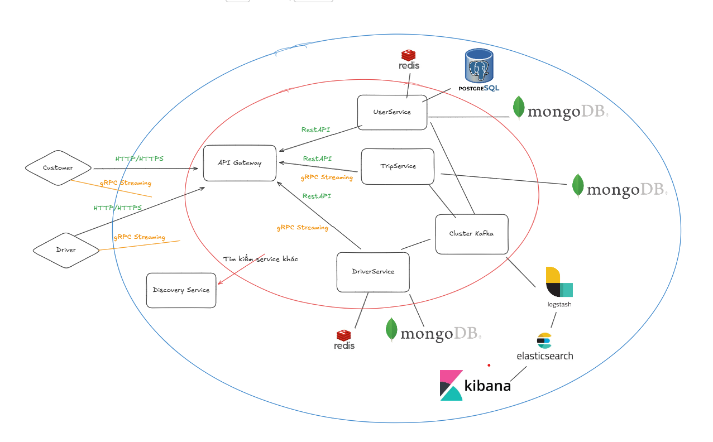

# UIT-Go System Architecture Document
**Project:** UIT-Go - Cloud-Native Ride Hailing Platform  
**Team:** [Tên Nhóm của bạn]  
**Modules:** A (Scalability), B (Reliability), E (Automation & Cost)  
**Version:** 1.0.0  

---

## 1. Tổng quan Kiến trúc Hệ thống (System Architecture Overview)

Hệ thống UIT-Go được xây dựng theo kiến trúc **Microservices Event-Driven**, tối ưu cho việc xử lý dữ liệu thời gian thực và mở rộng linh hoạt trên AWS.

---

### 1.1. Sơ đồ Logic (Logical Architecture)

#### A. Giao thức Giao tiếp & Gateway (Communication Layer)

##### **API Gateway**
Là điểm tiếp nhận duy nhất cho mọi request từ Client (Customer App, Driver App).  
Gateway đảm nhiệm các chức năng:

- **Routing**: Định tuyến request đến đúng microservice.  
- **Authentication**: Kiểm tra token, phân quyền người dùng.  
- **Load Balancing**: Phân phối đều tải đến các instances của service.

---

##### **gRPC Streaming (Bidirectional)**
Được sử dụng cho các luồng yêu cầu **độ trễ cực thấp** và **liên tục**, bao gồm:

- Cập nhật tọa độ tài xế theo thời gian thực.  
- Điều phối và xác nhận chuyến đi (Trip Dispatching).

---
##### **REST API (HTTP/HTTPS)**
Dùng cho các tác vụ **phi thời gian thực** hoặc **stateless**, ví dụ:

- Đăng ký tài khoản  
- Quản lý hồ sơ  
- Xem lịch sử chuyến đi  
- Thanh toán

